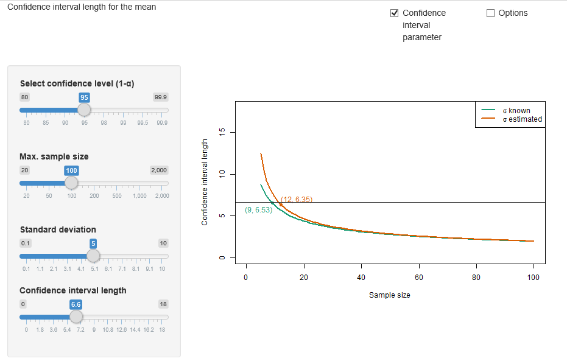

##  **MMSTAT_confi_mean_len**

##   [Shiny App](https://quantomas.shinyapps.io/MMSTATconfi_mean_len)

```yaml

Name of QuantLet : MMSTAT_confi_mean_len

Published in : MMSTAT

Description : 'Provides an interactive interface of the confidence interval length in the cases of both known and
unknown standard deviation. The user can choose the confidence level, sample size and standard
deviation. Additionally, a line is shown which indicates the sample size needed for a specific
confidence interval length.'

Keywords : 'plot, confidence interval, variance, mean, interactive, graphical representation, visualization,
normal-distribution, parameter, parametric, normal'

See also : 'KI, BCS_Conf2sided, BCS_Norm3, BCS_Norm2, MMSTATtime_series_1, MMSTATlinreg, MMSTATconfmean,
MMSTATconfi_sigma, MMSTATassociation, MMSTAThelper_function, MMSTATdistribution_normal'

Author : Yafei Xu

Submitted : 21/08/2015

Input : MMSTAThelper_function

Output : Interactive shiny application

Datafile :

Example: 
- 'Shows the confidence interval length under known and unknown standard deviation for a sample size of 100,
standard deviation = 5 and a confidence level = 95%.
Interactive user choice.'

```





```R

# please use "Esc" key to jump out of the Shiny app
rm(list = ls(all = TRUE))
graphics.off()

# please set working directory setwd('C:/...') 
# setwd('~/...')    # linux/mac os
# setwd('/Users/...') # windows

source("MMSTAThelper_function.r")

############################### SUBROUTINES ##################################
### server ###################################################################

shiny = sessionInfo()$otherPkgs$shiny

mmstat.ui.elem("conflevel", "confidenceLevel")
mmstat.ui.elem("sigmavar",  "sliderInput",
               label = gettext("Standard deviation"),
               min   = 0.1, 
               max   = 10, 
               step  = 0.1, 
               value = 5)
mmstat.ui.elem("length", "sliderInput",
               label = gettext("Confidence interval length"),
               min   = 0, 
               max   = 18,
               step  = 0.1, 
               value = 0)
mmstat.ui.elem("size", "sampleSize",  
               label = gettext("Max. sample size"))
mmstat.ui.elem("cex", "fontSize")

sqr    = function(x) { return(x*x) }
server = shinyServer(function(input, output, session) {  
  output$conflevelUI = renderUI({ mmstat.ui.call('conflevel') })
  output$sigmavarUI  = renderUI({ mmstat.ui.call('sigmavar') })
  output$lengthUI    = renderUI({ mmstat.ui.call('length') })
  output$cexUI       = renderUI({ mmstat.ui.call('cex')  })    
  output$sizeUI      = renderUI({ mmstat.ui.call('size', 
                                                 ticks = c(20, 50, 100, 200,
                                                           500, 1000, 2000), 
                                                 max   = 7) 
  })
  
  getSize = reactive({
    inp   = mmstat.getValues(NULL, size = input$size)
    ticks = c(20, 50, 100, 200, 500, 1000, 2000)
    ticks[inp$size]
  })
  
  output$outputConfPlot = renderPlot({
    mmstat.log(sprintf('outputConfPlot'))
    size = max(30, getSize())
    inp  = mmstat.getValues(NULL, 
                            conflevel = input$conflevel, 
                            sigmavar  = input$sigmavar, 
                            length    = input$length, 
                            cex       = input$cex)
    nval = 5:size
    oma  = mmstat$UI$conflevel$ticks[inp$conflevel]/100
    ln   = 2 * inp$sigmavar / sqrt(nval) * qnorm(1 - (1 - oma) / 2)
    lt   = 2 * inp$sigmavar/sqrt(nval) * qt(1 - (1 - oma) / 2, nval - 1)
    plot(0, 0, 
         xlim     = c(0, size), 
         ylim     = c(0,mmstat$UI$length$max), 
         type     = "n",
         xlab     = gettext("Sample size"), 
         ylab     = gettext("Confidence interval length"),
         cex.axis = inp$cex,
         cex.lab  = inp$cex,
         cex.main = 1.2 * inp$cex,
         cex.sub  = inp$cex)

    lines(nval, ln, col = mmstat$col[[1]], lwd = 2)
    if ((inp$length > min(ln)) && (inp$length < max(ln))) {
      pos = sum(ln > inp$length)
      text(nval[pos+1], 
      ln[pos+1], 
      labels = sprintf("(%0.f, %.2f)", nval[pos+1], ln[pos+1]), 
      adj    = c(1,1.5), 
      col    = mmstat$col[[1]], cex = inp$cex)
      points(nval[pos+1], ln[pos + 1], pch = 19, col = mmstat$col[[1]])
    }
    lines(nval, lt, col = mmstat$col[[2]], lwd = 2)
    if ((inp$length > min(lt)) && (inp$length < max(lt))) {
      pos = sum(lt > inp$length)
      text(nval[pos + 1], lt[pos + 1], 
      labels = sprintf("(%0.f, %.2f)", nval[pos+1], lt[pos+1]), 
      adj    = c(0, -0.5), 
      col    = mmstat$col[[2]], 
      cex    = inp$cex)
      points(nval[pos + 1], lt[pos + 1], pch = 19, col = mmstat$col[[2]])
    }
    abline(h = inp$length, col = gray(0.2))
    
    legend("topright", 
           legend = c(mmstat.math(" &sigma; known"), 
                      mmstat.math((" &sigma; estimated"))), 
           lwd    = 2, 
           col    = c(mmstat$col[[1]], 
                      mmstat$col[[2]]), 
           cex    = inp$cex)
    box()
  })    
 
  output$logText = renderText({
    mmstat.getLog(session)
  })
})

############################### SUBROUTINES ##################################
### ui #######################################################################

ui = shinyUI(fluidPage(
    
  div(class = "navbar navbar-static-top",
      div(class = "navbar-inner", 
          fluidRow(column(8, div(class = "brand pull-left", 
                                 gettext("Confidence interval length for the mean"))),
                   column(2, checkboxInput("showtest", 
                                           gettext("Confidence interval parameter"), 
                                           TRUE)),
                   column(2, checkboxInput("showoptions", gettext("Options"), 
                                           FALSE))))),
    
  sidebarLayout(
    sidebarPanel(
      conditionalPanel(
        condition = 'input.showtest',
        uiOutput("conflevelUI"),
        br(),
        uiOutput("sizeUI"),
        br(),
        uiOutput("sigmavarUI"),
        uiOutput("lengthUI")
      ),
      conditionalPanel(
        condition = 'input.showoptions',
        hr(),
        uiOutput("cexUI")
      )
    ),
    
    mainPanel(plotOutput("outputConfPlot"))),

  htmlOutput("logText")
  ))

############################### SUBROUTINES ##################################
### shinyApp #################################################################

shinyApp(ui = ui, server = server)

```
