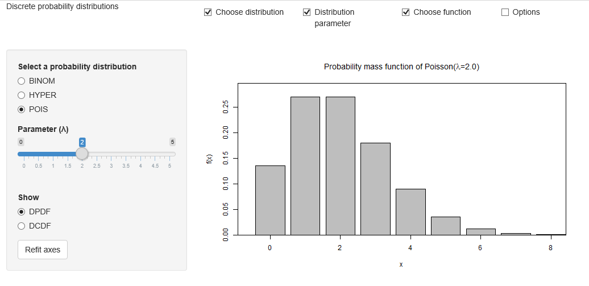

##  **MMSTATdistribution_poisson**

```yaml

Name of QuantLet : MMSTATdistribution_poisson

Published in : MMSTAT

Description : 'Produces an interactive interface to show
the probability mass
function (PDF) of the Poisson distribution. The default
settings produce a
histogram of the Poisson distribution with parameters
Lambda = 2.
The user can interactively choose a different number of
parameter (Lambda).
The user can also choose to show the CDF of the Poisson
distribution
with a step function. The user can choose two other
distributions:
the binomial distribution and the hypergeometric
distribution.'

Keywords : 'discrete, histogram, plot, poisson, binomial,
data visualization, empirical, estimation, parameter,
parametric, visualization, cdf, interactive, pdf '

See also : 'BCS_Hist1, BCS_Hist2, MMSTATtime_series_1,
MMSTATlinreg,
MMSTATconfmean, MMSTATconfi_sigma, MMSTATassociation,
MMSTAThelper_function'

Author : Sigbert Klinke

Code Editor: Yafei Xu

Submitted : 21/08/2015

Input : MMSTAThelper_function

Output : Interactive shiny application

Datafiles :

Example :
- 'Shows the probability mass function
of the Poisson distribution with parameter (Lambda = 8).
One can
see the PDF plotted as gray bins.'
```




```r

# ------------------------------------------------------------------------------
# Name of Quantlet: MMSTATdistribution_poisson
# ------------------------------------------------------------------------------
# Published in:     MMSTAT
# ------------------------------------------------------------------------------
# Description:      Produces an interactive interface to show the probability mass 
#                   function (PDF) of the Poisson distribution. The default settings produce a 
#                   histogram of the Poisson distribution with parameters Lambda = 2.
#                   The user can interactively choose a different number of parameter (Lambda). 
#                   The user can also choose to show the CDF of the Poisson distribution
#                   with a step function. The user can choose two other distributions: 
#                   the binomial distribution and the hypergeometric distribution.
# ------------------------------------------------------------------------------
# Keywords:         discrete, histogram, plot, poisson, binomial, 
#                   data visualization, empirical, estimation, parameter, 
#                   parametric, visualization, cdf, interactive, pdf 
# ------------------------------------------------------------------------------
# Usage:            MMSTAThelper_function
# ------------------------------------------------------------------------------
# Output:           Interactive shiny application
# ------------------------------------------------------------------------------
# Example:          Shows the probability mass function 
#                   of the Poisson distribution with parameter (Lambda = 8). One can 
#                   see the PDF plotted as gray bins.
# ------------------------------------------------------------------------------
# See also:         BCS_Hist1, BCS_Hist2, MMSTATtime_series_1, MMSTATlinreg, 
#                   MMSTATconfmean, MMSTATconfi_sigma, MMSTATassociation, 
#                   MMSTAThelper_function
# ------------------------------------------------------------------------------
# Author :          Sigbert Klinke
# ------------------------------------------------------------------------------
# Code Editor:      Yafei Xu
# ------------------------------------------------------------------------------ 

# please use "Esc" key to jump out of the Shiny app
rm(list = ls(all = TRUE))
graphics.off()

# please set working directory setwd('C:/...') 
# setwd('~/...')    # linux/mac os
# setwd('/Users/...') # windows

source("MMSTAThelper_function.r")

############################### SUBROUTINES ##################################
### server ###################################################################

gv     = list(dist = "mmstat", xlim = NULL, ylim = NULL)
distrd = "POIS"
radioc = gettext(c("DPDF", "DCDF"), "name")

mmstat.ui.elem("distribution", "radioButtons", 
               label    = gettext("Select a probability distribution"), 
               choices  = gettext(c("BINOM", "HYPER", "POIS"), "name"), 
               selected = distrd)
mmstat.ui.elem("binom.n", "sliderInput", 
               label = gettext("Number of draws (n)"), 
               min   = 2, 
               max   = 30, 
               value = 10, 
               step  = 1)
mmstat.ui.elem("binom.p", "sliderInput", 
               label = gettext("Probability of success per draw (p)"), 
               min   = 0, 
               value = 0.5, 
               step  = 0.01, 
               max   = 1)
mmstat.ui.elem("hyper.N", "sliderInput", 
               label = gettext("Population size (N)"), 
               min   = 20, 
               max   = 50, 
               value = 20, 
               step  = 1)
mmstat.ui.elem("hyper.n", 
               "sliderInput", 
               label = gettext("Number of draws (n)"), 
               min   = 0, 
               max   = 20, 
               value = 8, 
               step  = 1)
mmstat.ui.elem("hyper.M", 
               "sliderInput", 
               label = gettext("Number of success states
                               in the population (M)"), 
               min   = 0, 
               max   = 20, 
               value = 6, 
               step  = 1)
mmstat.ui.elem("pois.lambda", 
               "sliderInput", 
               label = HTML(gettext("Parameter (&lambda;)")), 
               min   = 0, 
               max   = 5, 
               value = 2, 
               step  = 0.1)
mmstat.ui.elem("pdforcdf", 
               "radioButtons", 
               label    = gettext("Show"), 
               choices  = radioc, 
               selected = "DPDF")
mmstat.ui.elem("refit", 
               "actionButton", 
               label = gettext("Refit axes"))
mmstat.ui.elem("cex", "fontSize")

server = shinyServer(function(input, output, session) {    
  output$pdforcdfUI = renderUI({
    mmstat.ui.call("pdforcdf")
  })
  output$refitUI = renderUI({
    mmstat.ui.call("refit")
  })
  output$pois.lambdaUI = renderUI({
    mmstat.ui.call("pois.lambda")
  })
  output$distributionUI = renderUI({
    mmstat.ui.call("distribution")
  })
  output$binom.nUI = renderUI({
    mmstat.ui.call("binom.n")
  })
  output$binom.pUI = renderUI({
    mmstat.ui.call("binom.p")
  })
  output$hyper.nUI = renderUI({
    mmstat.ui.call("hyper.n")
  })
  output$hyper.NUI = renderUI({
    mmstat.ui.call("hyper.N")
  })
  output$hyper.MUI = renderUI({
    mmstat.ui.call("hyper.M")
  })
  output$cexUI = renderUI({
    mmstat.ui.call("cex")
  })
  
  cdf = function(x, height) {
    n = length(x)
    if (n < 1) 
      stop("'x' must have 1 or more non-missing values")
    rval = approxfun(x, height, 
                     method = "constant", 
                     yleft  = 0, 
                     yright = 1, 
                     f      = 0, 
                     ties   = "ordered")
    class(rval) = c("ecdf", "stepfun", class(rval))
    rval
  }
  
  refit = reactive({
    inp = mmstat.getValues(NULL, refit = input$refit)
    gv$dist <<- "mmstat"
  })
  
  getDistribution = reactive({
    inp = mmstat.getValues(NULL, 
                           distribution = input$distribution, 
                           binom.p      = isolate(input$binom.p), 
                           binom.n      = isolate(input$binom.n), 
                           hyper.M      = isolate(input$hyper.M), 
                           hyper.N      = isolate(input$hyper.N), 
                           hyper.n      = isolate(input$hyper.n), 
                           pois.lambda  = isolate(input$pois.lambda))
    refit()
    if (gv$dist != inp$distribution) {
      if ((gv$dist == "BINOM") && (inp$distribution == "HYPER")) {
        # switch from binom to hyper
        updateSliderInput(session, inputId = "hyper.M", 
                          value = round(inp$binom.p * inp$hyper.N))
        updateSliderInput(session, inputId = "hyper.n", value = inp$binom.n)
      }
      if ((gv$dist == "BINOM") && (inp$distribution == "POIS")) {
        # switch from binom to pois
        updateSliderInput(session, inputId = "pois.lambda", 
                          value = round(inp$binom.p * inp$binom.n, digits = 1))
      }
      if ((gv$dist == "HYPER") && (inp$distribution == "BINOM")) {
        # switch from hyper to binom
        updateSliderInput(session, inputId = "binom.p", 
                          value = round(inp$hyper.M/inp$hyper.N, digits = 2))
        updateSliderInput(session, inputId = "binom.n", value = inp$hyper.n)
      }
      if ((gv$dist == "HYPER") && (inp$distribution == "POIS")) {
        # switch from hyper to pois
        updateSliderInput(session, inputId = "pois.lambda", 
                          value = round(inp$hyper.M/inp$hyper.N * 
                                        inp$hyper.n, digits = 1))
      }
      if ((gv$dist == "POIS") && (inp$distribution == "BINOM")) {
        # switch from pois to binom
        updateSliderInput(session, inputId = "binom.p", 
                          value = round(inp$pois.lambda/inp$binom.n, digits = 2))
      }
      if ((gv$dist == "pois") && (inp$distribution == "hyper")) {
        # switch from pois to hyper
        updateSliderInput(session, inputId = "hyper.M", 
                          value = round(inp$pois.lambda * 
                                        inp$hyper.N/inp$hyper.n))
      }
      gv$xlim <<- c(0, 0)
      gv$ylim <<- c(0, 0)
      gv$dist <<- inp$distribution
    }
    gv$dist
  })
  
  output$distPlot = renderPlot({
    inp = mmstat.getValues(NULL, 
                           binom.p      = input$binom.p, 
                           binom.n      = input$binom.n, 
                           cex          = input$cex, 
                           distribution = input$distribution, 
                           hyper.M      = input$hyper.M, 
                           hyper.N      = input$hyper.N, 
                           hyper.n      = input$hyper.n, 
                           pdforcdf     = input$pdforcdf, 
                           pois.lambda  = input$pois.lambda)
    getDistribution()
    switch(inp$distribution, BINOM = {
      gv$xlim <<- mmstat.merge(gv$xlim, c(0, inp$binom.n + 1))
      x = 0:gv$xlim[2]
      if (inp$pdforcdf == "DPDF") {
        height = dbinom(x, inp$binom.n, inp$binom.p)
        gv$ylim <<- mmstat.merge(gv$ylim, c(0, height))
        mp = barplot(height, 
                     xlim     = 1.3 * gv$xlim, 
                     ylim     = 1.1 * gv$ylim, 
                     ylab     = "f(x)", 
                     xlab     = "x", 
                     main     = sprintf(gettext("Probability mass function of B(n=%.0f, p=%.2f)"), 
                                        inp$binom.n, inp$binom.p), 
                     cex.axis = inp$cex, 
                     cex.lab  = inp$cex, 
                     cex.main = 1.2 * inp$cex, 
                     cex.sub  = inp$cex)
        mmstat.baraxis(1, x, mp, sprintf("%.f", x), cex.axis = inp$cex)
      } else {
        gv$ylim <<- mmstat.merge(gv$ylim, c(0, 1))
        height = pbinom(x, inp$binom.n, inp$binom.p)
        plot(cdf(x, height), 
             xlim     = gv$xlim, 
             ylim     = gv$ylim, 
             ylab     = "F(x)", 
             xlab     = "x", 
             main     = sprintf(gettext("Cumulative distribution function of B(n=%.0f, p=%.2f)"), 
                                inp$binom.n, inp$binom.p), 
             cex.axis = inp$cex, 
             cex.lab  = inp$cex, 
             cex.main = 1.2 * inp$cex, 
             cex.sub  = inp$cex)
      }
    }, HYPER = {
      gv$xlim <<- mmstat.merge(gv$xlim, c(0, inp$hyper.N + 1))
      x = 0:gv$xlim[2]
      if (inp$pdforcdf == "DPDF") {
        height = dhyper(x, inp$hyper.M, inp$hyper.N - inp$hyper.M, inp$hyper.n)
        gv$ylim <<- mmstat.merge(gv$ylim, c(0, height))
        mp = barplot(height, 
                     xlim     = 1.3 * gv$xlim, 
                     ylim     = 1.1 * gv$ylim, 
                     ylab     = "f(x)", 
                     xlab     = "x", 
                     main     = sprintf(gettext("Probability mass function of H(N=%.0f, M=%.0f, n=%.0f)"), 
                                        inp$hyper.N, inp$hyper.M, inp$hyper.n), 
                     cex.axis = inp$cex, 
                     cex.lab  = inp$cex, 
                     cex.main = 1.2 * inp$cex, 
                     cex.sub  = inp$cex)
        mmstat.baraxis(1, gv$xlim, mp, sprintf("%.f", 0:gv$xlim[2]), 
                       cex.axis = inp$cex)
      } else {
        gv$ylim <<- mmstat.merge(gv$ylim, c(0, 1))
        height = phyper(x, inp$hyper.M, inp$hyper.N - inp$hyper.M, inp$hyper.n)
        plot(cdf(x, height), 
             xlim     = gv$xlim, 
             ylim     = gv$ylim, 
             ylab     = "F(x)", 
             xlab     = "x", 
             main     = sprintf(gettext("Cumulative distribution function of H(N=%.0f, M=%.0f, n=%.0f)"), 
                                inp$hyper.N, inp$hyper.M, inp$hyper.n), 
             cex.axis = inp$cex, 
             cex.lab  = inp$cex, 
             cex.main = 1.2 * inp$cex, 
             cex.sub  = inp$cex)
      }
    }, POIS = {
      gv$xlim <<- mmstat.merge(gv$xlim, c(0, round(qpois(0.999, inp$pois.lambda))))
      x = 0:gv$xlim[2]
      if (inp$pdforcdf == "DPDF") {
        height = dpois(x, inp$pois.lambda)
        gv$ylim <<- mmstat.merge(gv$ylim, c(0, height))
        mp = barplot(height, 
                     xlim     = 1.3 * gv$xlim, 
                     ylim     = 1.1 * gv$ylim, 
                     ylab     = "f(x)", 
                     xlab     = "x", 
                     main     = mmstat.math(sprintf(gettext("Probability mass function of PO(&lambda;=%0.1f)"), 
                                            inp$pois.lambda)), 
                     cex.axis = inp$cex, 
                     cex.lab  = inp$cex, 
                     cex.main = 1.2 * inp$cex, 
                     cex.sub  = inp$cex)
        mmstat.baraxis(1, gv$xlim, mp, sprintf("%.f", 0:gv$xlim[2]),
                       cex.axis = inp$cex)
      } else {
        gv$ylim <<- mmstat.merge(gv$ylim, c(0, 1))
        height = ppois(x, inp$pois.lambda)
        plot(cdf(x, height), 
             xlim     = gv$xlim, 
             ylim     = gv$ylim, 
             ylab     = "F(x)", 
             xlab     = "x", 
             main     = mmstat.math(sprintf(gettext("Cumulative distribution function of PO(&lambda;=%0.1f)"), 
                                    inp$pois.lambda)), 
             cex.axis = inp$cex, 
             cex.lab  = inp$cex, 
             cex.main = 1.2 * inp$cex, 
             cex.sub  = inp$cex)
      }
    })
    box()
  })
  
  output$logText = renderText({
    # mmstat.getLog(session)
  })
})

############################### SUBROUTINES ##################################
### ui #######################################################################

ui = shinyUI(fluidPage(   
    
  div(class="navbar navbar-static-top",
    div(class = "navbar-inner", 
        fluidRow(column(4, div(class = "brand pull-left", 
                               gettext("Discrete probability
                                       distributions"))),
                 column(2, checkboxInput("showdist", 
                                         gettext("Choose distribution"), 
                                         TRUE)),
                 column(2, checkboxInput("showparameter", 
                                         gettext("Distribution parameter"), 
                                         TRUE)),
                 column(2, checkboxInput("showfunction", 
                                         gettext("Choose function"), 
                                         TRUE)),
                 column(2, checkboxInput("showoptions", 
                                         gettext("Options"), 
                                         FALSE))))),  
    sidebarLayout(
      sidebarPanel(
        conditionalPanel(
          condition = 'input.showdist',
          uiOutput("distributionUI")
          ),
        conditionalPanel(
          condition = "input.distribution=='BINOM'",
          conditionalPanel(
            condition = 'input.showparameter',
            uiOutput("binom.nUI"),
            uiOutput("binom.pUI")
            )
          ),
        conditionalPanel(
          condition = "input.distribution=='HYPER'",
          conditionalPanel(
            condition = 'input.showparameter',
            uiOutput("hyper.NUI"),
            uiOutput("hyper.MUI"),
            uiOutput("hyper.nUI")
            )
          ),
        conditionalPanel(
          condition = "input.distribution=='POIS'",
          conditionalPanel(
            condition = 'input.showparameter',
            uiOutput("pois.lambdaUI")
            )
          ),
        conditionalPanel(
          condition = 'input.showfunction',
          br(),
          uiOutput("pdforcdfUI"),
          uiOutput("refitUI")
          ),
        conditionalPanel(
          condition = 'input.showoptions',
          hr(),
          uiOutput("cexUI")
          )       
        ),
 
        mainPanel(plotOutput("distPlot"))
      ),

      htmlOutput("logText")
  ))
  
############################### SUBROUTINES ##################################
### shinyApp #################################################################

shinyApp(ui = ui, server = server)

```
