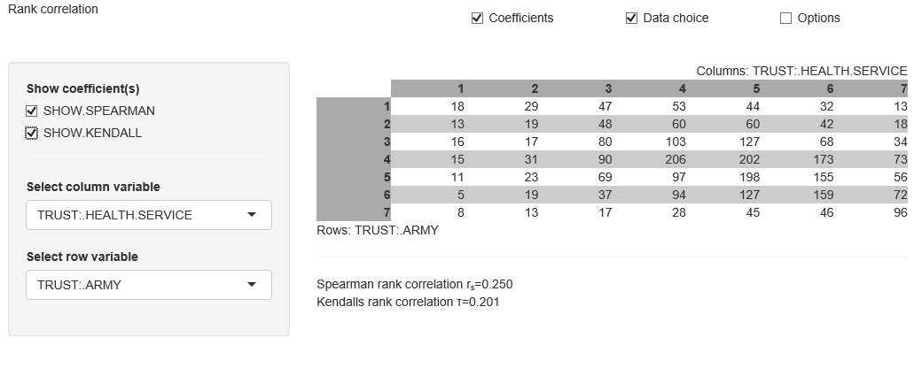

##  **MMSTATrank_correlation**

```yaml
Name of QuantLet : MMSTATrank_correlation

Published in : MMSTAT

Description : 'Shows a two dimensional contingency table. In the table, the correlation measures
Spearman''s rho and Kendall''s tau can be shown. The user can interactively choose the row and
column variables.'

Keywords : 'Kendalls Tau, correlation, contingency table, discrete, dispersion analysis, parameter,
interactive'

See also : 'MVAdrug, MVAdrugsim, COPcorrelation1, MMSTATtime_series_1, MMSTATlinreg,
MMSTATconfmean, MMSTATconfi_sigma, MMSTATassociation, MMSTAThelper_function'

Author : Sigbert Klinke

Code Editor: Yafei Xu

Submitted : 21/08/2015

Input : MMSTAThelper_function

Output : Interactive shiny application

Datafiles : 'ALLBUS1992-ECON.rds, ALLBUS2002-ECON.rds, ALLBUS2012-ECON.rds, ALLBUS1994-TRUST.rds,
ALLBUS2002-TRUST.rds, ALLBUS2012-TRUST.rds'

Example : - 'Shows the contingency table using the variables of TRUST:.HEALTH.SERVICE and
TRUST:.ARMY. The Spearman''s rank correlation and Kendall''s rank correlation are computed.'
```




```r
# ------------------------------------------------------------------------------
# Name of Quantlet: MMSTATrank_correlation
# ------------------------------------------------------------------------------
# Published in:     MMSTAT
# ------------------------------------------------------------------------------
# Description:      Shows a two dimensional contingency table. In the table, the
#                   correlation measures Spearman's rho and Kendall's tau can 
#                   be shown. The user can interactively choose the row and column variables.
# ------------------------------------------------------------------------------
# Keywords:         Kendalls Tau, correlation, contingency table, discrete, 
#                   dispersion analysis, parameter, interactive
# ------------------------------------------------------------------------------
# Usage:            MMSTAThelper_function
# ------------------------------------------------------------------------------
# Output:           Interactive shiny application
# ------------------------------------------------------------------------------
# Example:          Shows the contingency table using the variables
#                   of TRUST:.HEALTH.SERVICE and TRUST:.ARMY. The Spearman's rank
#                   correlation and Kendall's rank correlation are computed.               
# ------------------------------------------------------------------------------
# See also:         MVAdrug, MVAdrugsim, COPcorrelation1, MMSTATtime_series_1, 
#                   MMSTATlinreg, MMSTATconfmean, MMSTATconfi_sigma, 
#                   MMSTATassociation, MMSTAThelper_function
# ------------------------------------------------------------------------------
# Author :          Sigbert Klinke
# ------------------------------------------------------------------------------
# Code Editor:      Yafei Xu
# ------------------------------------------------------------------------------
# Datafiles:        ALLBUS1992-ECON.rds, ALLBUS2002-ECON.rds, ALLBUS2012-ECON.rds,
#                   ALLBUS1994-TRUST.rds, ALLBUS2002-TRUST.rds, ALLBUS2012-TRUST.rds
# ------------------------------------------------------------------------------

# please use "Esc" key to jump out of the Shiny app
rm(list = ls(all = TRUE))
graphics.off()

# please set working directory setwd('C:/...') 
# setwd('~/...')    # linux/mac os
# setwd('/Users/...') # windows

source("MMSTAThelper_function.r")

############################### SUBROUTINES ##################################
### server ###################################################################

mmstat$vartype = 'ordvars'
mmstat.ui.elem('coeff', 'checkboxGroupInput',
               label   = gettext("Show coefficient(s)"),
               choices = gettext(c("SHOW.SPEARMAN", "SHOW.KENDALL"), "name"),
               value   = character())
mmstat.ui.elem("dataset", "dataSet",     
               choices=mmstat.getDataNames("ALLBUS1994-TRUST", 
                                           "ALLBUS2002-TRUST", 
                                           "ALLBUS2012-TRUST", 
                                           "ALLBUS1992-ECON", 
                                           "ALLBUS2002-ECON", 
                                           "ALLBUS2012-ECON"))
mmstat.ui.elem("variableYSelect", "variable1", vartype = "ordered", 
               label = gettext("Select column variable"))
mmstat.ui.elem("variableXSelect", "variable1", vartype = "ordered",
               label = gettext("Select row variable"))
mmstat.ui.elem("cex", "fontSize")

server = shinyServer(function(input, output, session) {
  
  output$coeffUI           = renderUI({ mmstat.ui.call('coeff') })
  output$variableXSelectUI = renderUI({ mmstat.ui.call('variableXSelect') })
  output$variableYSelectUI = renderUI({ mmstat.ui.call('variableYSelect') })
  output$cexUI             = renderUI({ mmstat.ui.call('cex') })

  observe({
    inp = mmstat.getValues(NULL, dataset=input$dataset)
    updateSelectInput(session, "variableYSelect",
                      choices  = mmstat.getVarNames(inp$dataset, 'ordered'),
                      selected = mmstat$dataset[[inp$dataset]]$ordvars[1])
    updateSelectInput(session, "variableXSelect",
                      choices  = mmstat.getVarNames(inp$dataset, 'ordered'),
                      selected = mmstat$dataset[[inp$dataset]]$ordvars[2])
  })
  
  output$contingencyTable = renderText({
    inp   = mmstat.getValues(NULL, 
                             dataset         = input$dataset,
                             coeff           = input$coeff,
                             variableXSelect = input$variableXSelect,
                             variableYSelect = input$variableYSelect,
                             cex             = input$cex)
    varx  = mmstat.getVar(isolate(inp$dataset), varname=inp$variableXSelect)
    vary  = mmstat.getVar(isolate(inp$dataset), varname=inp$variableYSelect)
    tab   = table(varx$values, vary$values)
    vars  = c(gettext(vary$name), gettext(varx$name))
    lines = NULL
    for (i in seq(inp$coeff)) {
      if (inp$coeff[i]=="SHOW.SPEARMAN") {
        lines = c(lines, sprintf(gettext("Spearman rank correlation r<sub>s</sub>=%.3f"), 
                                 cor(as.numeric(varx$values), 
                                     as.numeric (vary$values), 
                                     method = "s")))
      }
      if (inp$coeff[i]=="SHOW.KENDALL") {        
        lines = c(lines, sprintf(gettext("Kendalls rank correlation &tau;=%.3f"), 
                                 cor(as.numeric(varx$values), 
                                     as.numeric(vary$values), 
                                     method = "k")))
      }
    } 
    HTML(htmlTable(tab, vars=vars, lines=lines, cex=inp$cex))
  })
  
  output$logText = renderText({
    mmstat.getLog(session)
  })
})

############################### SUBROUTINES ##################################
### ui #######################################################################

ui = shinyUI(fluidPage(
  div(class="navbar navbar-static-top",
      div(class = "navbar-inner", 
          fluidRow(column(6, div(class = "brand pull-left",
                                 gettext("Rank correlation"))),
                   column(2, checkboxInput("showcoeff", 
                                           gettext("Coefficients"), TRUE)),
                   column(2, checkboxInput("showdata", 
                                           gettext("Data choice"), TRUE)),
                   column(2, checkboxInput("showoptions", 
                                           gettext("Options"), FALSE))))),
  sidebarLayout(
    sidebarPanel(
      conditionalPanel(
        condition = 'input.showcoeff',
        uiOutput("coeffUI")
      ),
      conditionalPanel(
        condition = 'input.showdata',
        hr(),
        uiOutput("datasetUI"),
        uiOutput("variableYSelectUI"),
        uiOutput("variableXSelectUI")
      ),
      conditionalPanel(
        condition = 'input.showoptions',
        hr(),
        uiOutput("cexUI")
      )
    ),
    mainPanel(htmlOutput("contingencyTable"))),

  htmlOutput("logText")  
))

############################### SUBROUTINES ##################################
### shinyApp #################################################################

shinyApp(ui = ui, server = server)

```
