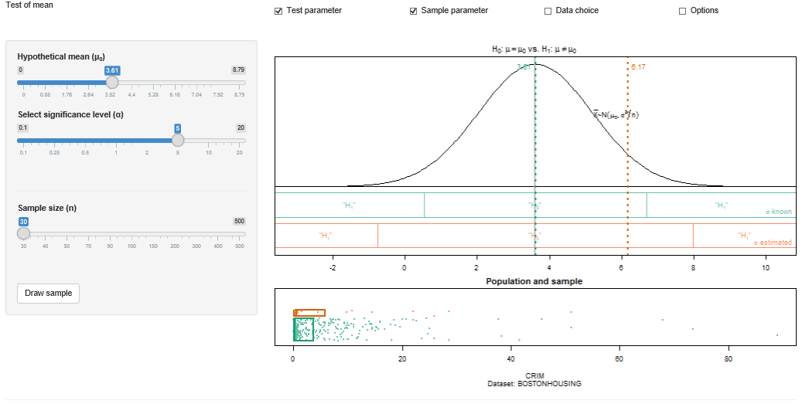

##  **MMSTATtest_mean**

```yaml
Name of QuantLet : MMSTATtest_mean

Published in : MMSTAT

Description : 'Gives an interactive interface including options of sample size, hypothetical mean
and significance level for user to test the mean value of a sample drawing from a chosen data set.'

Keywords : 'test, plot, scatterplot, boxplot, mean, median, quantile, visualization, data
visualization, parameter, interactive, uscrime'

See also : 'BCS_tPdfCdf, BCS_NormPdfCdf, BCS_Boxplot, norm, MMSTATtime_series_1, MMSTATlinreg,
MMSTATconfmean, MMSTATconfi_sigma, MMSTATassociation, MMSTAThelper_function'

Author : Sigbert Klinke

Code Editor: Yafei Xu

Submitted : 21/08/2015

Input : MMSTAThelper_function

Output : Interactive shiny application

Datafiles : USCRIME.rds, BOSTONHOUSING.rds

Example : 'Shows the mean test with hypothetical mean equal to 3.61 and significance level equal to
5 percent under the context of sample size of 30.'
```




```r
# ------------------------------------------------------------------------------
# Name of Quantlet: MMSTATtest_mean
# ------------------------------------------------------------------------------
# Published in:     MMSTAT
# ------------------------------------------------------------------------------
# Description:      Gives an interactive interface including options of sample 
#                   size, hypothetical mean and significance level for user to test
#                   the mean value of a sample drawing from a chosen data set.
# ------------------------------------------------------------------------------
# Keywords:         test, plot, scatterplot, boxplot, mean, median, quantile,
#                   visualization, data visualization, parameter, interactive, 
#                   uscrime
# ------------------------------------------------------------------------------
# Usage:            MMSTAThelper_function
# ------------------------------------------------------------------------------
# Output:           Interactive shiny application
# ------------------------------------------------------------------------------
# Example:          Shows the mean test with hypothetical mean equal to 3.61 and
#                   significance level equal to 5 percent under the context of 
#                   sample size of 30.              
# ------------------------------------------------------------------------------
# See also:         BCS_tPdfCdf, BCS_NormPdfCdf, BCS_Boxplot, norm,
#                   MMSTATtime_series_1, MMSTATlinreg, MMSTATconfmean, 
#                   MMSTATconfi_sigma, MMSTATassociation, MMSTAThelper_function
# ------------------------------------------------------------------------------
# Author :          Sigbert Klinke
# ------------------------------------------------------------------------------
# Code Editor:      Yafei Xu
# ------------------------------------------------------------------------------
# Datafiles:        USCRIME.rds, BOSTONHOUSING.rds
# ------------------------------------------------------------------------------

# please use "Esc" key to jump out of the Shiny app
rm(list = ls(all = TRUE))
graphics.off()

# please set working directory setwd('C:/...') 
# setwd('~/...')    # linux/mac os
# setwd('/Users/...') # windows

source("MMSTAThelper_function.r")

############################### SUBROUTINES ##################################
### server ###################################################################

mmstat$vartype = "numvars"

mmstat.ui.elem("test", "testHypotheses")
mmstat.ui.elem("mu0", "sliderInput", 
               label = HTML(gettext("Hypothetical mean (&mu;<sub>0</sub>)")))
mmstat.ui.elem("alpha", "significance")
mmstat.ui.elem("size", "sampleSize")
mmstat.ui.elem("go", "drawSample")
mmstat.ui.elem("dataset", "dataSet", 
               choices = mmstat.getDataNames("BOSTONHOUSING",  "USCRIME"))
mmstat.ui.elem("variable", "variable1", vartype = "numeric")
mmstat.ui.elem("cex", "fontSize")

drawIqrBoxWithPoints = function(x, jitter, ylim, box.param = NULL, points.param = NULL) {
  if (is.list(points.param) || is.null(points.param) || points.param) {
    points.param$x = x
    points.param$y = ylim[1] + diff(ylim) * jitter
    suppressWarnings(do.call("points", points.param))
  }
  if (is.list(box.param) || is.null(box.param) || box.param) {
    q                 = quantile(x, c(0.25, 0.5, 0.75))
    box.param$xleft   = q[1]
    box.param$xright  = q[3]
    box.param$ybottom = ylim[1]
    box.param$ytop    = ylim[2]
    suppressWarnings(do.call("rect", box.param))
    box.param$x       = c(q[2], q[2])
    box.param$y       = ylim
    if (!is.null(box.param$border)) 
      box.param$col = box.param$border
    suppressWarnings(do.call("lines", box.param))
  }
}

server = shinyServer(function(input, output, session) {
  
  output$alphaUI = renderUI({
    mmstat.ui.call("alpha")
  })
  output$goUI = renderUI({
    mmstat.ui.call("go")
  })
  output$datasetUI = renderUI({
    mmstat.ui.call("dataset")
  })
  output$cexUI = renderUI({
    mmstat.ui.call("cex")
  })
  
  output$mu0UI = renderUI({
    var   = getVar()
    alpha = mmstat$UI$alpha$ticks[1]
    mmstat.ui.call("mu0", 
                 min   = mmstat.round.down(max(var$min, 
                                               qnorm(min(alpha)/200, 
                                                     var$mean, 
                                                     var$sd/sqrt(30))), 
                                           var$decimal), 
                 max   = mmstat.round.up(min(var$max, 
                                             qnorm(1 - min(alpha)/200, 
                                             var$mean, 
                                             var$sd/sqrt(30))), 
                                         var$decimal), 
                 value = round(var$mean, var$decimal), 
                 step  = 10^(-var$decimal))
  })
  
  output$sizeUI = renderUI({
    var = getVar()
    mmstat.ui.call("size", ticks = var$ticks, max = length(var$ticks))
  })
  
  output$variableUI = renderUI({
    mmstat.log("variableUI")
    inp = mmstat.getValues(NULL, dataset = input$dataset)
    mmstat.ui.call("variable", 
                   choices = mmstat.getVarNames(inp$dataset, "numeric"))
  })
  
  getVar = reactive({
    mmstat.log(paste("getVar"))
    var         = mmstat.getVar(isolate(input$dataset), input$variable)
    var$ticks   = mmstat.ticks(var$n, nmin = 30)
    dec         = mmstat.dec(0.1 * c(0, var$sd/sqrt(max(var$ticks))))
    var$decimal = dec$decimal
    var
  })
  
  drawSample = reactive({
    inp    = mmstat.getValues(NULL, go = input$go, size = input$size)
    var    = getVar()
    index  = sample(var$n, var$ticks[inp$size], replace = T)
    values = var$values[index]
    list(values = values, 
         jitter = runif(length(values)), 
         index  = index, 
         range  = range(values), 
         mean   = mean(values), 
         sd     = sd(values), 
         n      = length(values))
  })
  
  output$outputTestPlot = renderPlot({
    mmstat.log("outputTestPlot")
    var    = getVar()
    sample = drawSample()
    inp    = mmstat.getValues(list(mu0 = var$mean), 
                              alpha = input$alpha, 
                              mu0   = input$mu0, 
                              cex   = input$cex)
    if (is.list(sample)) {
      xq.mu = inp$mu0
      xq.sd = sample$sd/sqrt(sample$n)
      xlim  = range(qnorm(c(1e-05, 0.99999), 
                          inp$mu0, var$sd/sqrt(30)), 
                    qnorm(c(1e-05, 0.99999), 
                          var$mean, 
                          var$sd/sqrt(30)))
      x     = mmstat.pos(xlim, (0:300)/300)
      y     = dnorm(x, xq.mu, var$sd/sqrt(sample$n))
      my    = max(y)
      ylim  = my * c(-0.5, 1)
      par(mar = c(2, 0, 2, 0))
      plot(x, y, 
           type     = "l", 
           xlab     = "", 
           xlim     = xlim, 
           ylim     = ylim, 
           axes     = F, 
           main     = mmstat.math("&H[0];: &mu==mu[0]; vs. &H[1];: &mu!=mu[0]; "), 
           ylab     = "", 
           cex.axis = inp$cex, 
           cex.lab  = inp$cex, 
           cex.main = 1.2 * inp$cex, 
           cex.sub  = inp$cex)
      abline(h = 0)
      mmstat.axis(1, xlim, cex.axis = inp$cex)
      usr = par("usr")
      xp  = qnorm(0.75, xq.mu, xq.sd)
      yp  = dnorm(xp, xq.mu, xq.sd)
      text(xp, yp, mmstat.math(" &bar(X);~&N(mu[0], sigma^2/n); "), 
           pos = 4, 
           cex = inp$cex)
      
      c = qnorm(1 - mmstat$alpha[inp$alpha]/200)
      mmstat.plotTestRegions(inp$mu0 + var$sd/sqrt(sample$n) * c(-c, c), 
                             xlim  = usr[1:2], 
                             ylim  = -my * c(0.05, 0.25), 
                             cex   = inp$cex, 
                             col   = mmstat$col[[9]], 
                             label = mmstat.math(gettext(" &sigma; known")), 
                             pos   = 2 + 2 * (var$mean > inp$mu0))
      c = qt(1 - mmstat$alpha[inp$alpha]/200, sample$n - 1)
      mmstat.plotTestRegions(inp$mu0 + sample$sd/sqrt(sample$n) * c(-c, c), 
                             xlim  = usr[1:2], 
                             ylim  = -my * c(0.3, 0.5), 
                             cex   = inp$cex, 
                             col   = mmstat$col[[10]], 
                             label = mmstat.math(gettext(" &sigma; estimated")), 
                             pos   = 2 + 2 * (var$mean > inp$mu0))
      
      abline(v = xq.mu, col = "gray", lwd = 2)
      abline(v = sample$mean, col = mmstat$col[[2]], lwd = 2, lty = "dotted")
      abline(v = var$mean, col = mmstat$col[[1]], lwd = 2, lty = "dotted")
      ypos = mmstat.pos(usr[3:4], 0.95)
      text(sample$mean, ypos, sprintf("%.*f", var$decimal, sample$mean), 
           pos = 4 - 2 * (sample$mean < var$mean), 
           col = mmstat$col[[2]], 
           cex = inp$cex)
      text(var$mean, ypos, sprintf("%.*f", var$decimal, var$mean), 
           pos = 2 + 2 * (sample$mean < var$mean), 
           col = mmstat$col[[1]], 
           cex = inp$cex)
      box()
    }
  })
  
  output$outputSamplePlot = renderPlot({
    mmstat.log(sprintf("outputSamplePlot"))
    var  = getVar()
    samp = drawSample()
    inp  = mmstat.getValues(NULL, cex = input$cex)
    par(mar = c(5, 0, 2, 0))
    plot(range(var$values), c(-0.05, 1), 
         type     = "n", 
         axes     = F, 
         main     = gettext("Population and sample"), 
         xlab     = var$xlab, 
         sub      = var$sub, 
         cex.axis = inp$cex, 
         cex.lab  = inp$cex, 
         cex.main = 1.2 * inp$cex, 
         cex.sub  = inp$cex)
    usr = par("usr")
    mmstat.axis(1, usr[1:2], cex.axis = inp$cex)
    drawIqrBoxWithPoints(var$values, var$jitter, 
                         ylim         = c(0, 0.45), 
                         box.param    = list(border = mmstat$col[[1]], lwd = 2), 
                         points.param = list(col = mmstat$col[[9]], 
                         pch          = 19, 
                         cex          = 0.5 * inp$cex))
    drawIqrBoxWithPoints(samp$values, samp$jitter, 
                         ylim         = 0.5 + c(0, 0.45 * sqrt(length(samp$values)/var$n)), 
                         box.param    = list(border = mmstat$col[[2]],  lwd = 2), 
                         points.param = list(col = mmstat$col[[10]], 
                         pch          = 19, 
                         cex          = 0.5 * inp$cex))
    
    box()
  })
  
  output$logText = renderText({
    mmstat.getLog(session)
  })
})

############################### SUBROUTINES ##################################
### ui #######################################################################

ui = shinyUI(fluidPage(
  div(class="navbar navbar-static-top",
      div(class = "navbar-inner", 
          fluidRow(column(4, div(class = "brand pull-left", gettext("Test of mean"))),
                   column(2, checkboxInput("showtest", gettext("Test parameter"), TRUE)),
                   column(2, checkboxInput("showsample", gettext("Sample parameter"), TRUE)),
                   column(2, checkboxInput("showdata", gettext("Data choice"), FALSE)),
                   column(2, checkboxInput("showoptions", gettext("Options"), FALSE))))),
    
    sidebarLayout(
      sidebarPanel(
        conditionalPanel(
          condition = 'input.showtest',
          uiOutput("mu0UI"),
          uiOutput("alphaUI"),
          br()
        ),
        conditionalPanel(
          condition = 'input.showsample',
          hr(),
          uiOutput("sizeUI"),
          br(),
          br(),
          uiOutput("goUI")
        ),
        conditionalPanel(
          condition = 'input.showdata',
          hr(),
          uiOutput("datasetUI"),
          uiOutput("variableUI")
        ),
        conditionalPanel(
          condition = 'input.showoptions',
          hr(),
          uiOutput("cexUI")
        )
      ),
    
      mainPanel(plotOutput("outputTestPlot"),
                plotOutput("outputSamplePlot", height = "200px"))),

      htmlOutput("logText")
))
  
############################### SUBROUTINES ##################################
### shinyApp #################################################################

shinyApp(ui = ui, server = server)

```
