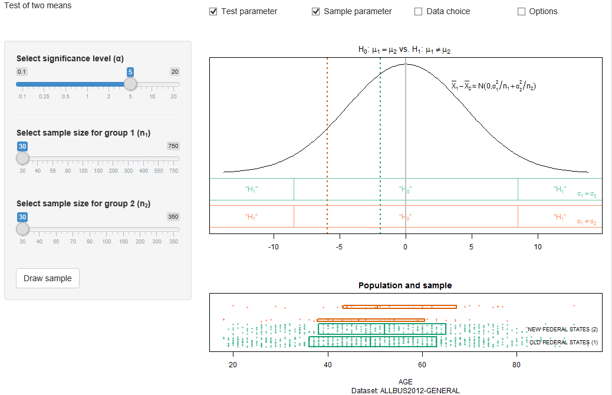

##  **MMSTATtest_two_means**

```yaml
Name of QuantLet : MMSTATtest_two_means

Published in : MMSTAT

Description : 'Shows an interactive interface to test for the equality of two means. The user can
select the significance level alpha and the sample size for variable 1 and variable 2, the data set
and the respective variables. The upper panel shows the theoretical t-distribution and respective
rejection areas depending on whether we assume equal or unequal variances of the variables.  The
lower panel shows scatter plots of the population and the sample for both variables including boxed
indicating the interquartile range and the mean. The samples can be drawn from ALLBUS2012-GENERAL,
ALLBUS2002-GENERAL, and ALLBUS2004-GENERAL.'

Keywords : 'test, plot, scatterplot, boxplot, mean, quantile, parametric visualization, data
visualization, parameter, interactive, estimation, normal-distribution, t-distribution, Hypothesis
Testing, sampling, population, variance'

See also : 'SMStestuscomp, hotellingstat, BCS_Boxplot, norm, MMSTATtime_series_1, MMSTATlinreg,
MMSTATconfmean, MMSTATconfi_sigma, MMSTATassociation, MMSTAThelper_function'

Author : Sigbert Klinke

Code Editor: Yafei Xu

Submitted : 21/08/2015

Input : MMSTAThelper_function

Output : Interactive shiny application

Datafiles : 'ALLBUS2012-GENERAL.rds, ALLBUS2002-GENERAL.rds, ALLBUS2004-GENERAL.rds'

Example : 'Shows the test with alpha = 5%, size of sample 1 (n1) = 30 and size of sample 2 (n2) =
30'
```




```r
# ------------------------------------------------------------------------------
# Name of Quantlet: MMSTATtest_two_means
# ------------------------------------------------------------------------------
# Published in:     MMSTAT
# ------------------------------------------------------------------------------
# Description:      Shows an interactive interface to test for the equality of two means.
#                   The user can select the significance level alpha and the sample size for variable 1
#                   and variable 2, the data set and the respective variables.
#                   The upper panel shows the theoretical t-distribution and respective
#                   rejection areas depending on whether we assume equal or unequal variances of the variables. 
#                   The lower panel shows scatter plots of the population and the sample for both
#                   variables including boxed indicating the interquartile range and the mean.
#                   The samples can be drawn from ALLBUS2012-GENERAL, ALLBUS2002-GENERAL,
#                   and ALLBUS2004-GENERAL.
# ------------------------------------------------------------------------------
# Keywords:         test, plot, scatterplot, boxplot, mean, quantile, parametric
#                   visualization, data visualization, parameter, interactive,
#                   estimation, normal-distribution, t-distribution, Hypothesis Testing,
#                   sampling, population, variance
# ------------------------------------------------------------------------------
# Usage:            MMSTAThelper_function
# ------------------------------------------------------------------------------
# Output:           Interactive shiny application
# ------------------------------------------------------------------------------
# Example:          Shows the test with alpha = 5%, size of sample 1 (n1) = 30 and 
#                   size of sample 2 (n2) = 30      
# ------------------------------------------------------------------------------
# See also:         SMStestuscomp, hotellingstat, BCS_Boxplot, norm,
#                   MMSTATtime_series_1, MMSTATlinreg, MMSTATconfmean, 
#                   MMSTATconfi_sigma, MMSTATassociation, MMSTAThelper_function
# ------------------------------------------------------------------------------
# Author :          Sigbert Klinke
# ------------------------------------------------------------------------------
# Code Editor:      Yafei Xu
# ------------------------------------------------------------------------------
# Datafiles:        ALLBUS2012-GENERAL.rds, ALLBUS2002-GENERAL.rds,
#                   ALLBUS2004-GENERAL.rds
# ------------------------------------------------------------------------------

# please use "Esc" key to jump out of the Shiny app
rm(list = ls(all = TRUE))
graphics.off()

# please set working directory setwd('C:/...') 
# setwd('~/...')    # linux/mac os
# setwd('/Users/...') # windows

source("MMSTAThelper_function.r")

############################### SUBROUTINES ##################################
### server ###################################################################

mmstat.plotTestRegions = function(crit, xlim, ylim, cex, close = F, col = "black", 
  label = NULL, pos = 1) {
  lines(xlim, c(ylim[1], ylim[1]), col = col)
  lines(xlim, c(ylim[2], ylim[2]), col = col)
  if (close) {
    lines(c(xlim[1], xlim[1]), ylim, col = col)
    lines(c(xlim[2], xlim[2]), ylim, col = col)
  }
  cu = max(crit[1], xlim[1])
  if (crit[1] >= xlim[1]) {
    lines(c(cu, cu), ylim, col = col)
    text((cu + xlim[1])/2, mean(ylim), mmstat.math("\\\"&H[1];\\\""), 
         cex = cex, col = col)
  }
  co = min(crit[2], xlim[2])
  if (crit[2] <= xlim[2]) {
    lines(c(co, co), ylim, col = col)
    text((co + xlim[2])/2, mean(ylim), mmstat.math("\\\"&H[1];\\\""), 
         cex = cex, col = col)
  }
  text((co + cu)/2, mean(ylim), mmstat.math("\\\"&H[0];\\\""), cex = cex, col = col)
  if (!is.null(text)) {
    if (pos == 2) 
      text(xlim[1], mmstat.pos(ylim, -0.25), label, col = col, cex = cex, pos = 4)
    if (pos == 4) 
      text(xlim[2], mmstat.pos(ylim, -0.25), label, col = col, cex = cex, pos = 2)
  }
}


mmstat.plotTestRegions = function(crit, xlim, ylim, cex, close = F, col = "black", 
  label = NULL, pos = 1) {
  lines(xlim, c(ylim[1], ylim[1]), col = col)
  lines(xlim, c(ylim[2], ylim[2]), col = col)
  if (close) {
    lines(c(xlim[1], xlim[1]), ylim, col = col)
    lines(c(xlim[2], xlim[2]), ylim, col = col)
  }
  cu = max(crit[1], xlim[1])
  if (crit[1] >= xlim[1]) {
    lines(c(cu, cu), ylim, col = col)
    text((cu + xlim[1])/2, mean(ylim), mmstat.math("\\\"&H[1];\\\""), 
         cex = cex, col = col)
  }
  co = min(crit[2], xlim[2])
  if (crit[2] <= xlim[2]) {
    lines(c(co, co), ylim, col = col)
    text((co + xlim[2])/2, mean(ylim), mmstat.math("\\\"&H[1];\\\""), 
         cex = cex, col = col)
  }
  text((co + cu)/2, mean(ylim), mmstat.math("\\\"&H[0];\\\""), cex = cex, col = col)
  if (!is.null(text)) {
    if (pos == 2) 
      text(xlim[1], mmstat.pos(ylim, -0.25), label, col = col, cex = cex, pos = 4)
    if (pos == 4) 
      text(xlim[2], mmstat.pos(ylim, -0.25), label, col = col, cex = cex, pos = 2)
  }
}


mmstat.ui.elem("test", "testHypotheses")
mmstat.ui.elem("alpha", "significance")
mmstat.ui.elem("size1", "sampleSize", 
               label = HTML(gettext("Select sample size for 
                                    group 1 (n<sub>1</sub>)")))
mmstat.ui.elem("size2", "sampleSize", 
               label = HTML(gettext("Select sample size for
                                    group 2 (n<sub>2</sub>)")))
mmstat.ui.elem("go", "drawSample")
mmstat.ui.elem("dataset", "dataSet", 
               choices = mmstat.getDataNames("ALLBUS2012-GENERAL", 
                                             "ALLBUS2004-GENERAL", 
                                             "ALLBUS2002-GENERAL"))
mmstat.ui.elem("variable", "variable1", vartype = "numeric")
mmstat.ui.elem("group", "variable1", 
               vartype = "binary", 
               label   = gettext("Select a group variable"))
mmstat.ui.elem("cex", "fontSize")

drawIqrBoxWithPoints = function(x, jitter, ylim, box.param = NULL, points.param = NULL) {
  if (is.list(points.param) || is.null(points.param) || points.param) {
    points.param$x = x
    points.param$y = ylim[1] + diff(ylim) * jitter
    suppressWarnings(do.call("points", points.param))
  }
  if (is.list(box.param) || is.null(box.param) || box.param) {
    q                 = quantile(x, c(0.25, 0.5, 0.75), na.rm = T)
    box.param$xleft   = q[1]
    box.param$xright  = q[3]
    box.param$ybottom = ylim[1]
    box.param$ytop    = ylim[2]
    suppressWarnings(do.call("rect", box.param))
    box.param$x       = c(q[2], q[2])
    box.param$y       = ylim
    if (!is.null(box.param$border)) 
      box.param$col   = box.param$border
    suppressWarnings(do.call("lines", box.param))
  }
}

server = shinyServer(function(input, output, session) {
  
  output$alphaUI = renderUI({
    mmstat.ui.call("alpha")
  })
  output$goUI = renderUI({
    mmstat.ui.call("go")
  })
  output$datasetUI = renderUI({
    mmstat.ui.call("dataset")
  })
  output$cexUI = renderUI({
    mmstat.ui.call("cex")
  })
  
  output$size1UI = renderUI({
    var = getVar()
    grp = getGroup()
    mmstat.ui.call("size1", 
                   ticks = mmstat.ticks(grp$tab[1], nmin = 30), 
                   max   = length(var$ticks))
  })
  
  output$size2UI = renderUI({
    var   = getVar()
    grp   = getGroup()
    ticks = mmstat.ticks(grp$tab[2], nmin = 30)
    mmstat.ui.call("size2", ticks = ticks, max = length(ticks))
  })
  
  output$variableUI = renderUI({
    inp = mmstat.getValues(NULL, dataset = input$dataset)
    mmstat.ui.call("variable", choices = mmstat.getVarNames(inp$dataset, "numeric"))
  })
  
  output$groupUI = renderUI({
    inp = mmstat.getValues(NULL, dataset = input$dataset)
    mmstat.ui.call("group", choices = mmstat.getVarNames(inp$dataset, "binary"))
  })
  
  getVar = reactive({
    inp         = mmstat.getValues(NULL, 
                                 dataset  = isolate(input$dataset), 
                       variable = input$variable)
    var         = mmstat.getVar(inp$dataset, inp$variable, "numeric")
    var$ticks   = mmstat.ticks(var$n, nmin = 30)
    dec         = mmstat.dec(0.1 * c(0, var$sd/sqrt(max(var$ticks))))
    var$decimal = dec$decimal
    var
  })
  
  getGroup = reactive({
    inp = mmstat.getValues(NULL, 
                           group   = input$group, 
                           dataset = isolate(input$dataset))
    var = mmstat.getVar(inp$dataset, inp$group, "binary")
    var
  })
  
  drawSample = reactive({
    inp    = mmstat.getValues(NULL, 
                              go    = input$go, 
                              size1 = input$size1, 
                              size2 = input$size2)
    var    = getVar()
    grp    = getGroup()
    ticks  = mmstat.ticks(grp$tab[1], nmin = 30)
    index  = (1:var$n)[grp$values == levels(grp$values)[1]]
    index1 = sample(grp$tab[1], ticks[inp$size1], replace = T)
    sampl1 = mmstat.attrVar(var, "numvars", index[index1])
    ticks  = mmstat.ticks(grp$tab[2], nmin = 30)
    index  = (1:var$n)[grp$values == levels(grp$values)[2]]
    index2 = sample(grp$tab[2], ticks[inp$size2], replace = T)
    sampl2 = mmstat.attrVar(var, "numvars", index[index2])
    list(sampl1, sampl2)
  })
  
  output$outputTestPlot = renderPlot({
    mmstat.log("outputTestPlot")
    var     = getVar()
    grp     = getGroup()
    samples = drawSample()    
    inp     = mmstat.getValues(NULL, alpha = input$alpha, cex = input$cex)
    grp1    = grp$values == levels(grp$values)[1]
    grp2    = grp$values == levels(grp$values)[2]
    mupop1  = mean(var$values[grp1], na.rm = T)
    mupop2  = mean(var$values[grp2], na.rm = T)
    s2pop1  = var(var$values[grp1], na.rm = T)
    s2pop2  = var(var$values[grp2], na.rm = T)
    n1      = length(samples[[1]]$values)
    n2      = length(samples[[2]]$values)
    sgpop   = sqrt(s2pop1/n1 + s2pop2/n2)
    xlim    = qnorm(c(0.001, 0.999), 
                    mean = 0, 
                    sd   = sqrt(s2pop1/30 + s2pop2/30))
    x       = xlim[1] + diff(xlim) * (0:300)/300
    y       = dnorm(x, mean = 0, sd = sgpop)
    my      = max(y)
    ylim    = my * c(-0.5, 1)
    par(mar = c(5, 0, 2, 0))
    plot(x, y, 
         type     = "l", 
         xlab     = "", 
         xlim     = xlim, 
         ylim     = ylim, 
         axes     = F, 
         main     = mmstat.math("&H[0];: &mu[1]==mu[2]; vs. &H[1];: &mu[1]!=mu[2]; "), 
         ylab     = "", 
         cex.axis = inp$cex, 
         cex.lab  = inp$cex, 
         cex.main = 1.2 * inp$cex, 
         cex.sub  = inp$cex)
    usr = par("usr")
    s12 = samples[[1]]$var
    s22 = samples[[2]]$var
    # equal variances
    oma  = mmstat$UI$alpha$ticks[inp$alpha]/100
    dist = qt(1 - oma/2, n1 + n2 - 2) * sqrt(((n1 - 1) * 
           s12 + (n2 - 1) * s22)/(n1 + n2 - 2) * (1/n1 + 1/n2))
    mmstat.plotTestRegions(c(-dist, dist), 
                           xlim  = usr[1:2], 
                           ylim  = -my * c(0.05, 0.25), 
                           cex   = inp$cex, 
                           col   = mmstat$col[[9]], 
                           label = mmstat.math(gettext(" &sigma[1]==sigma[2]; ")), 
                           pos   = 4)
    # unequal variances
    df   = floor((s12/n1 + s22/n2)^2/(s12^2/n1^2/(n1 - 1) + s22^2/n2^2/(n2 - 1)))
    dist = qt(1 - oma/2, df) * sqrt(s12/n1 + s22/n2)
    mmstat.plotTestRegions(c(-dist, dist), 
                           xlim  = usr[1:2], 
                           ylim  = -my * c(0.3, 0.5), 
                           cex   = inp$cex, 
                           col   = mmstat$col[[10]], 
                           label = mmstat.math(gettext(" &sigma[1]!=sigma[2]; ")), 
                           pos   = 4)
    # 
    mmstat.axis(1, xlim, cex.axis = inp$cex)
    abline(v   = samples[[1]]$mean - samples[[2]]$mean, 
           col = mmstat$col[[2]], 
           lwd = 2, 
           lty = "dotted")
    abline(v   = mupop1 - mupop2, 
           col = mmstat$col[[1]], 
           lwd = 2, 
           lty = "dotted")
    abline(v = 0, col = "gray", lwd = 2)   
    xp = qnorm(0.75, 0, sgpop)
    yp = dnorm(xp, 0, sgpop)
    text(xp, yp, mmstat.math(" &bar(X)[1]-bar(X)[2]%~~%N(0*','*sigma[1]^2/n[1]+sigma[2]^2/n[2]); "), 
         pos = 4, cex = inp$cex)
    box()
  })
  
  output$outputSamplePlot = renderPlot({
    mmstat.log(sprintf("outputSamplePlot"))
    var     = getVar()
    grp     = getGroup()
    samples = drawSample()
    inp     = mmstat.getValues(NULL, cex = input$cex)
    par(mar = c(5, 0, 2, 0))
    plot(range(var$values), c(-0.05, 1), 
         type     = "n", 
         axes     = F, 
         main     = gettext("Population and sample"), 
         xlab     = var$xlab, 
         sub      = var$sub, 
         cex.axis = inp$cex, 
         cex.lab  = inp$cex, 
         cex.main = 1.2 * inp$cex, 
         cex.sub  = inp$cex)
    usr = par("usr")
    mmstat.axis(1, usr[1:2], cex.axis = inp$cex)
    lgrp = levels(grp$values)
    grp1 = grp$values == lgrp[1]
    drawIqrBoxWithPoints(var$values[grp1], var$jitter[grp1], 
                         ylim         = c(0, 0.2), 
                         box.param    = list(border = mmstat$col[[1]], lwd = 2), 
                         points.param = list(col = mmstat$col[[9]], 
                         pch          = 19, 
                         cex          = 0.5 * inp$cex))
    text(usr[2], 0.1, paste(gettext(lgrp[1]), "(1)"), 
         pos = 2, 
         cex = 0.75 * inp$cex)
   grp2 = grp$values == lgrp[2]
    drawIqrBoxWithPoints(var$values[grp2], var$jitter[grp2], 
                         ylim         = 0.25 + c(0, 0.2), 
                         box.param    = list(border = mmstat$col[[1]], lwd = 2), 
                         points.param = list(col = mmstat$col[[9]], 
                         pch          = 19, 
                         cex          = 0.5 * inp$cex))
    text(usr[2], 0.35, paste(gettext(lgrp[2]), "(2)"), 
       pos = 2, 
       cex = 0.75 * inp$cex)
    drawIqrBoxWithPoints(samples[[1]]$values, samples[[1]]$jitter, 
                         ylim         = 0.5 + c(0, 0.2 * sqrt(length(samples[[1]]$values)/grp$tab[1])), 
                         box.param    = list(border = mmstat$col[[2]], lwd = 2), 
                         points.param = list(col = mmstat$col[[10]], 
                         pch          = 19, 
                         cex          = 0.5 * inp$cex))
    drawIqrBoxWithPoints(samples[[2]]$values, samples[[2]]$jitter, 
                         ylim         = 0.75 + c(0, 0.2 * sqrt(length(samples[[2]]$values)/grp$tab[2])), 
                         box.param    = list(border = mmstat$col[[2]],  lwd = 2), 
                         points.param = list(col = mmstat$col[[10]], 
                         pch          = 19, 
                         cex          = 0.5 * inp$cex))
    box()
  })
  
  output$logText = renderText({
    mmstat.getLog(session)
  })
})

############################### SUBROUTINES ##################################
### ui #######################################################################

ui = shinyUI(fluidPage(
  div(class="navbar navbar-static-top",
      div(class = "navbar-inner", 
          fluidRow(column(4, div(class = "brand pull-left", gettext("Test of two means"))),
                   column(2, checkboxInput("showtest", gettext("Test parameter"), TRUE)),
                   column(2, checkboxInput("showsample", gettext("Sample parameter"), TRUE)),
                   column(2, checkboxInput("showdata", gettext("Data choice"), FALSE)),
                   column(2, checkboxInput("showoptions", gettext("Options"), FALSE))))),
    
    sidebarLayout(
      sidebarPanel(
        conditionalPanel(
          condition = 'input.showtest',
          uiOutput("alphaUI")
        ),
        conditionalPanel(
          condition = 'input.showsample',
          hr(),
          uiOutput("size1UI"),
          br(),
          uiOutput("size2UI"),
          br(),
          uiOutput("goUI")
        ),
        conditionalPanel(
          condition = 'input.showdata',
          hr(),
          uiOutput("datasetUI"),
          uiOutput("variableUI"),
          uiOutput("groupUI")
        ),
        conditionalPanel(
          condition = 'input.showoptions',
          hr(),
          uiOutput("cexUI")
        )
      ),
    
      mainPanel(plotOutput("outputTestPlot"),
                plotOutput("outputSamplePlot", height = "200px"))),

      htmlOutput("logText")
  ))
  
############################### SUBROUTINES ##################################
### shinyApp #################################################################

shinyApp(ui = ui, server = server)

```
